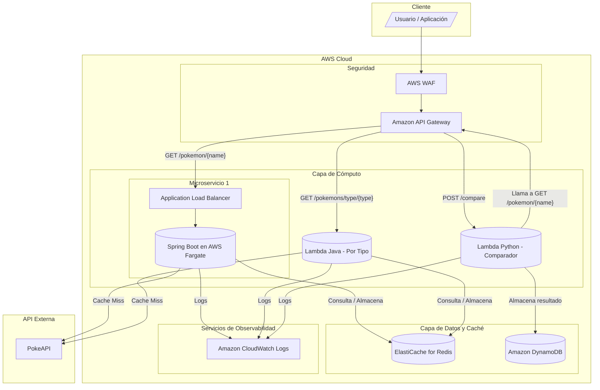

# Propuesta de Diseño Arquitectónico para la Plataforma Pokémon

**Realizado por: José Daniel Castellanos.**

El propósito de este documento es presentar una solución arquitectónica escalable y resiliente para la “plataforma” de microservicios Pokémon. La propuesta se basa en el mejoramiento de los tres microservicios desarrollados del desafío 1, el cuál consistía en 3 microservicios en diferentes tecnologías para: 1. Obtener estadísticas (Java, Spring boot), 2. Listar por tipo (Java, AWS Lambda) y 3. Comparar Pokémon (Python, AWS Lambda) y los potencia con servicios de AWS para satisfacer requisitos de alto rendimiento y disponibilidad.

## 1\. Diseño General de la Arquitectura

### 1.1. Descripción de la Arquitectura

La arquitectura propuesta es un sistema **Serverless-First** y nativo de la nube, puesto que los 3 microservicios desarrollados se tuvieron que desplegar en la nube de AWS para dar cumplimiento a los requerimientos individuales de cada uno. Así que, mi propuesta considera mejorar los servicios ya existentes, por medio de la interacción de otros servicios de AWS, en pro de maximizar la escalabilidad automática, minimizar la sobrecarga operativa y optimizar los costos.

El único punto de entrada para todas las solicitudes es **Amazon API Gateway**, que actúa como puerta de entrada segura y centralizada. Desde allí, las solicitudes se enrutan al servicio correspondiente.

Para garantizar una capa de seguridad, es imprescindible implementar **AWS WAF**. El tráfico primero pasaría a través del firewall que ofrece este servicio, para filtrar las solicitudes maliciosas.

Para mejorar el rendimiento de las múltiples solicitudes de distintos usuarios y reducir la latencia y la carga sobre la PokeAPI externa, se introduce una capa de caché centralizada con **Amazon ElastiCache for Redis**. Antes de reenviar la solicitud al microservicio correspondiente, se realiza una comprobación en la caché. Si los datos solicitados (ej. las estadísticas de "pikachu") están en la caché, se devuelven inmediatamente a través de API Gateway al cliente, finalizando el flujo. Si los datos no están en la caché, la solicitud continúa hacia el microservicio.

El **Microservicio 1 (Spring Boot)** se podría modernizar para ejecutarse en un entorno de contenedores serverless con **AWS Fargate**, gestionado por **Amazon ECS (Elastic Container Service)** y expuesto a través de un **Application Load Balancer (ALB)** para una escalabilidad y distribución de carga eficientes.

Los **Microservicios 2 y 3** continúan siendo funciones en **AWS Lambda**, debido a su alcance, para aprovechar la escalabilidad inherente y modelo de pago por uso que dicho servicio ofrece.

La persistencia de las comparaciones del **Microservicio 3** podría evolucionar de archivos de texto en S3 a una base de datos NoSQL gestionada, usando **Amazon DynamoDB**, para permitir consultas estructuradas y un acceso más rápido.

Finalmente, toda la arquitectura está instrumentada para ser monitoreada profundamente utilizando **Amazon CloudWatch**.

### 1.2. Tecnologías propuestas

| Componente | Tecnología Propuesta | Rol y Justificación |
| :--- | :--- | :--- |
| **Punto de Entrada** | Amazon API Gateway | Proporciona un único endpoint RESTful para los clientes. Gestiona la autenticación, autorización, limitación de velocidad (throttling) y enrutamiento de solicitudes a los microservicios correspondientes. |
| **Seguridad de Borde** | AWS WAF (Web Application Firewall) | Se integra con API Gateway para proteger la API contra exploits web comunes como inyecciones SQL y Cross-Site Scripting (XSS), aumentando la seguridad de la plataforma. |
| **Capa de Caché** | Amazon ElastiCache for Redis | Almacena respuestas frecuentes de la PokeAPI (ej. estadísticas de Pokémon populares, listas de tipos). Reduce drásticamente la latencia para el usuario final y disminuye el número de llamadas a la API externa. |
| **Microservicio 1 (Stats)** | Java/Spring Boot en AWS Fargate (ECS) | El servicio de estadísticas se ejecuta como un contenedor Docker gestionado por Fargate. Este enfoque elimina la necesidad de gestionar servidores (EC2), permite el autoescalado basado en CPU/memoria y se integra perfectamente con el ecosistema de AWS. |
| **Balanceador de Carga** | Application Load Balancer (ALB) | Distribuye el tráfico de manera uniforme entre las múltiples instancias del contenedor del Microservicio 1 que se ejecutan en Fargate, garantizando alta disponibilidad y escalabilidad. |
| **Microservicio 2 (Tipos)**| Java/AWS Lambda | Permanece como una función Lambda. Su naturaleza orientada a eventos y su escalabilidad automática son perfectas para la tarea de obtener listas de Pokémon por tipo, que puede tener una carga de trabajo variable. |
| **Microservicio 3 (Comparación)**| Python/AWS Lambda | Permanece como una función Lambda. Responsable de la lógica de comparación, consumiendo datos del Microservicio 1 a través de la arquitectura interna (API Gateway). |
| **Base de Datos de Resultados**| Amazon DynamoDB | Reemplaza el almacenamiento de archivos `.txt` en S3. Almacena los resultados de las comparaciones de forma estructurada (JSON), permitiendo consultas complejas, análisis y una recuperación de datos mucho más eficiente. |
| **Monitoreo y Logging** | Amazon CloudWatch | Centraliza los logs de todos los servicios (Lambdas, Fargate, API Gateway) y recopila métricas de rendimiento. Permite la creación de alarmas para notificar sobre comportamientos anómalos (ej. aumento de la tasa de errores, alta latencia). |
| **Fuente de Datos Externa**| PokeAPI | La fuente de verdad para todos los datos de Pokémon. |

### 1.3. Diagrama de Arquitectura

## 2\. Flujo de Datos Detallado

### 2.1. Flujo 1: Obtener Estadísticas de un Pokémon (Microservicio 1)

1.  Cliente envía `GET https://api.dominio.com/pokemon/pikachu`.
2.  API Gateway recibe la solicitud y la valida a través de AWS WAF.
3.  La lógica de integración de API Gateway comprueba si `pokemon:pikachu` existe en ElastiCache.
4.  **Cache Miss**: La solicitud se reenvía al Application Load Balancer.
5.  ALB selecciona una tarea saludable de Fargate y le envía la solicitud.
6.  El Microservicio 1 (Spring Boot) recibe la solicitud, extrae "pikachu".
7.  El servicio realiza una llamada `GET` a `https://pokeapi.co/api/v2/pokemon/pikachu`.
8.  La PokeAPI responde con un JSON complejo.
9.  El Microservicio 1 mapea la respuesta a su DTO `PokemonStatsResponse` usando el patrón Builder.
10. El servicio almacena la respuesta en ElastiCache con la clave `pokemon:pikachu` y un TTL (ej. 24 horas).
11. La respuesta JSON simplificada se devuelve a través de la cadena ALB -\> API Gateway -\> Cliente.

### 2.2. Flujo 2: Obtener Pokémon por Tipo (Microservicio 2)

1.  Cliente envía `GET https://api.dominio.com/pokemons/type/fire`.
2.  API Gateway recibe y valida la solicitud.
3.  Se comprueba la clave `type:fire` en ElastiCache.
4.  **Cache Miss**: API Gateway invoca la Lambda del Microservicio 2 con un payload que contiene `"type": "fire"`.
5.  La Lambda extrae el tipo y llama a `https://pokeapi.co/api/v2/type/fire`.
6.  La PokeAPI responde con una lista de Pokémon de ese tipo.
7.  La Lambda procesa la respuesta, la almacena en ElastiCache con la clave `type:fire` y un TTL.
8.  La lista de Pokémon se devuelve al cliente a través de API Gateway.

### 2.3. Flujo 3: Comparar dos Pokémon (Microservicio 3)

1.  Cliente envía `POST https://api.dominio.com/compare` con el body `{"pokemon1": "charizard", "pokemon2": "blastoise"}`.
2.  API Gateway recibe y valida la solicitud.
3.  API Gateway invoca la Lambda del Microservicio 3.
4.  La Lambda de comparación necesita las estadísticas. Realiza dos llamadas `GET` a su propio endpoint de API Gateway:
      - `GET https://api.dominio.com/pokemon/charizard`
      - `GET https://api.dominio.com/pokemon/blastoise`
5.  Al consumir su propia API, se beneficia de la capa de caché, la seguridad y la trazabilidad ya implementadas.
6.  Para cada llamada, se ejecuta el Flujo 1. Es muy probable que si estos Pokémon son populares, sus datos ya estén en la caché, por lo que las llamadas serán extremadamente rápidas.
7.  Una vez que la Lambda del Microservicio 3 tiene las estadísticas de ambos Pokémon, aplica la lógica del **Strategy Pattern** para determinar el ganador.
8.  La Lambda crea un item JSON con el resultado, por ejemplo: `{"comparisonId": "uuid", "winner": "charizard", "loser": "blastoise", "timestamp": "..."}`.
9.  Este item se escribe en la tabla de Amazon DynamoDB.
10. Se devuelve una respuesta de éxito al cliente, ej: `{"result": "Charizard es más fuerte que Blastoise"}`.

## 3\. Estrategias de Escalabilidad

  * **Microservicio 1 (Spring Boot en Fargate):**

      * **Escalabilidad Horizontal**: Se configura un Servicio de ECS con un número mínimo y máximo de tareas (contenedores).
      * **Autoescalado**: Se definen políticas de AWS Application Auto Scaling basadas en métricas de CloudWatch como el uso promedio de CPU o memoria. Si la CPU supera el 75%, Fargate lanzará automáticamente nuevas tareas. El ALB las registrará y les enviará tráfico.

  * **Microservicios 2 y 3 (AWS Lambda):**

      * **Escalabilidad Inherente**: Lambda escala horizontalmente de forma automática. Cada solicitud concurrente puede (y generalmente lo hace) desencadenar la creación de una nueva instancia de la función, hasta los límites de concurrencia de la cuenta.
      * **Concurrencia Provisionada**: Si se identifican problemas de "arranque en frío" (cold starts) que afecten la latencia, se puede configurar concurrencia provisionada para mantener un número de instancias de la función "calientes" y listas para responder instantáneamente.

  * **API Gateway:**

      * Es un servicio totalmente gestionado y altamente escalable por diseño. Maneja picos de tráfico sin necesidad de configuración manual. Los límites de throttling (tasa de solicitudes) se pueden configurar por ruta para proteger los servicios backend.

  * **Amazon DynamoDB:**

      * Se configurará en modo de capacidad **On-Demand**. Esto permite que la base de datos escale automáticamente la capacidad de lectura y escritura para adaptarse a la carga de trabajo sin aprovisionamiento manual, lo cual es ideal para cargas de trabajo impredecibles.

## 4\. Manejo de Trazabilidad

  * **IDs de Correlación**: Se generará un ID de correlación único (ej. `X-Request-ID`) en API Gateway para cada solicitud entrante. Este ID se propagará en los encabezados HTTP a todos los servicios posteriores (Fargate, otras llamadas a API Gateway) y se incluirá en el contexto de las invocaciones de Lambda.
  * **Logging Centralizado**: Todos los servicios se configurarán para generar logs en formato JSON estructurado a **Amazon CloudWatch Logs**. Cada entrada de log incluirá el `X-Request-ID`. Esto permite buscar y filtrar todas las entradas de log relacionadas con una sola solicitud a través de múltiples servicios usando CloudWatch Logs Insights.

## 5\. Manejo de Concurrencia

  * **Throttling en API Gateway**: Se establecerán límites de uso (tasa de ráfaga y tasa sostenida) en API Gateway para evitar que un aumento repentino de solicitudes de un cliente sobrecargue los servicios backend o la PokeAPI externa.
  * **Patrón Circuit Breaker**: El Microservicio 1 (Spring Boot) debe implementar el patrón de disyuntor (ej. con Resilience4j) en su cliente HTTP que llama a la PokeAPI. Si la PokeAPI comienza a fallar o a responder lentamente, el disyuntor se "abrirá", y las solicitudes posteriores fallarán inmediatamente sin esperar un timeout. Esto protege al servicio de la degradación del rendimiento debido a una dependencia externa.
  * **Concurrencia de Lambda**: Los límites de concurrencia de Lambda actúan como un mecanismo de protección natural. Si el Microservicio 3 realiza demasiadas llamadas al Microservicio 1, el escalado de Fargate se activaría.
  * **Estado**: La arquitectura es fundamentalmente sin estado (*stateless*). El estado de la sesión no se almacena en ninguna de las instancias de cómputo. El estado de la aplicación se externaliza a servicios gestionados como ElastiCache (caché) y DynamoDB (persistencia), lo que permite que las unidades de cómputo (tareas de Fargate, e instancias de Lambda) se creen y destruyan libremente.
